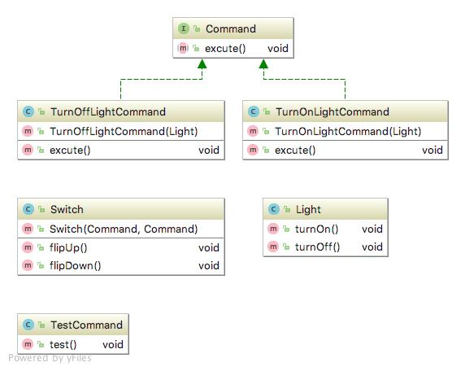

# Design patterns study
2017.11.02 ~ 2018.01.18
 - 1주차: Strategy pattern
 - 2주차: Observer pattern
 - 3주차: Decorator pattern
 - 4주차: Factory pattern
 - 5주차: Singleton pattern
 - 6주차: Command pattern
 - 7주차: Adapter pattern & facade pattern
 - 8주차: Template method pattern
 - 9주차: Iterators and composite patterns
 - 10주차: State pattern
 - 11주차: The proxy pattern
 - 12주차: The compound pattern (MVC)
---
# Command pattern

커맨드 패턴(Command pattern)이란 요청을 객체의 형태로 캡슐화하여 사용자가 보낸 요청을 나중에 이용할 수 있도록 매서드 이름, 매개변수 등 요청에 필요한 정보를 저장 또는 로깅, 취소할 수 있게 하는 패턴이다.

### 상세설명

 - 명령(command), 수신자(reiceiver), 발동자(invoker), 클라이언트(client) 구성.
 - 커맨드 객체는 수신자 객체를 가지고 있다.
 - 수신자의 메서드를 호출하여 수신자는 자신의 메서드를 수행한다.
 - 커맨드 객체는 발동자 객체에 전달되어 명령을 발동하게 된다.
 - 발동자 객체는 필요에 따라 명령 발동에 대한 기록을 남길 수 있다.
 - 한 발동자 객체에 다수의 커맨드 객체가 전달 될 수 있다.
 - 클라이언트 객체는 발동자 객체와 하나 이상의 커맨드 객체를 보유한다.
   
### 클래스 설명

 - Command.java : command interface
 - TurnOffLightCommand.java : command object1
 - TurnOnLightCommand.java : command object2
 - Light.java : reiceiver
 - Switch.java : invorker
 - TestCommand.java : client
  
### 다이어그램

### 참조:

[1]https://ko.wikipedia.org/wiki/%EC%BB%A4%EB%A7%A8%EB%93%9C_%ED%8C%A8%ED%84%B4
