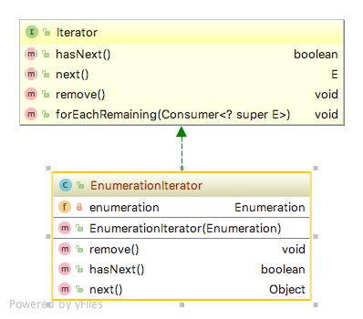
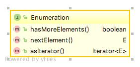

# Adapter pattern
어댑터 패턴(Adapter pattern)은 한 클래스의 인터페이스를 클라이언트에서 사용하고자 하는 다른 인터페이스로 변환하는 패턴이다. 어댑터를 이용하면 인터페이스 호환성 문제 때문에 같이 쓸 수 없는 클래스들을 연결해서 쓸 수 있습니다.

### 상세설명
 - 두 인터페이스간에 상호작용에 관여한다.
 - 따라서 일반적으로 JAVA를 이용하면서 JNI를 통해 C코드를 사용하는 것과는 거리가 있다. 이것은 단순히 함수집합이라고 볼 수 있다.
 - 어댑터가 완벽하게 적용될 수 없는 경우가 존재하기도한다. 따라서 클라이언트에서 예외가 생길 수 있는 가능성을 염두에 두고 있어야 한다.
   
### 클래스 설명
 - Enumeration.java : Older version of Iterator.java
 - Iterator.java : Interface to replace Enumeration.
 - EnumerationIterator.java : adapter pattern 
 
### 다이어그램

### 참조:
[1]https://en.wikipedia.org/wiki/Adapter_pattern

[2]https://github.com/bethrobson/Head-First-Design-Patterns