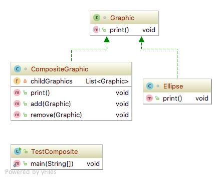

# Composite pattern
컴포지트 패턴(Composite pattern)이란 객체들의 관계를 트리 구조로 구성하여 부분-전체 계층을 표현하는 패턴으로, 사용자가 단일 객체와 복합 객체 모두 동일하게 다루도록 한다.

### 상세설명
   - 컴포지트 패턴은 어떤 문제들을 해결할 수 있는가?
     1. 클라이언트가 부분이나 전체를 다룰수 균등하게 있도록 부분에서 전체의 계층을 나타낼 수 있다.
     2. 부분에서 전체의 계층을 트리구조로 나타낼 수 있다.
   - 컴포지트 패턴은 어떤 방법으로 표현되는가?
     1. 부분 객체(단말 노드)와 전체 객체(부모 노드) 모두에 대해 통합된 구성 요소 인터페이스를 정의한다.
     2. 각 부분 객체는 컴포넌트 인터페이스ㄹ 직접 구현하고,컴포지트 객체는 클라이언트의 요청을 하위 구성 요소로 전달한다.
### 클래스 설명
   - Graphic.java : component
   - CompositeGraphic.java : composite object
   - Ellipse.java : leaf object
   - TestComposite : client
 
### 다이어그램

### 참조:
[1]https://en.wikipedia.org/wiki/Composite_pattern

