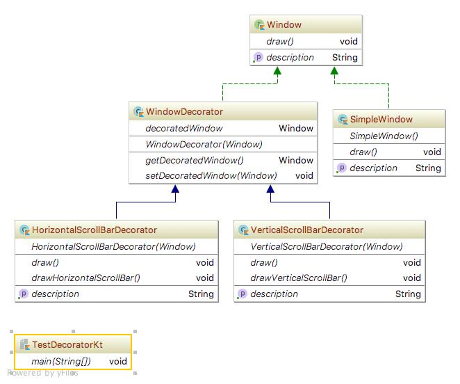

# Decorator pattern
데코레이터 패턴(Decorator pattern)이란 주어진 상황 및 용도에 따라 어떤 객체에 책임을 덧붙이는 패턴으로, 기능 확장이 필요할 때 서브클래싱 대신 쓸 수 있는 유연한 대안이 될 수 있다.

## 상세설명
 - 꾸밈을 당하는 클래스와 꾸며주는 클래스로 나뉨.
 - 두 기능을 수행하는 클래스는 하나의 인터페이스 혹은 추상클래스로 묶음.
 - 꾸밈을 당하는 클래스는 꾸밈을 당해도 결국 자기 자신을 유지하게 된다.
 - Java swing의 Frame을 꾸미는 것을 예로 들 수 있다.

## 클래스 설명 (Kotlin)
 - Window.kt : Window interface
 - SimpleWindow.kt : Window object
 - WindowDecorator.kt : Decorator abstract class
 - HorizontalScrollBarDecorator.kt : Decorator1
 - VerticalScrollBarDecorator.kt : Decorator2
 - TestDecorator.kt : include main method 
 
## 다이어그램

## 참조
[1]http://wiki.c2.com/?DecoratorPattern