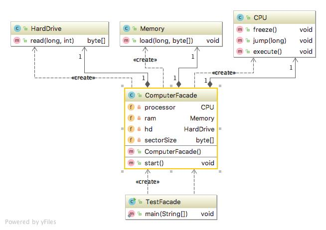

# Facade pattern
퍼사드 패턴(Facade pattern)은 복잡한 시스템을 사용자가 보다 쉽게 접근하기위한 패턴으로 사용된다.

### 상세설명
 - 시스템이 매우 복잡하거나 이해하기 어려울 때 자주 사용한다.
 - 시스템에 많은 상호 의존 클래스가 있거나 소스코드를 사용할 수 없기 때문이다.
 - 시스템의 복잡성을 숨기고 클라이언트에게 간단한 인터페이스를 제공한다.
    
### 클래스 설명
 - CPU.java : A class imitating a CPU.
 - Memory.java : A class that mimics memory.
 - HardDrive.java : A class imitating a hard drive.
 - ComputerFacade.java : Facade pattern
 - TestFacade.java : Test class
 
### 다이어그램

### 참조:
[1]https://en.wikipedia.org/wiki/Adapter_pattern