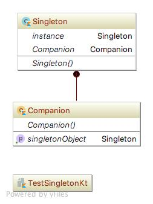

# Singleton pattern
싱글톤 패턴(Singleton pattern)은 클래스 객체의 인스턴스를 하나로 제한하는 디자인 패턴이다.
### 상세설명
 - 전체 시스템을 작업을 조정하는데 정확히 하나의 객체가 필요한 경우에 유용함.
 - 하나의 객체만 존재할 때보다 효율적으로 작동한다면 인스턴스 생성을 특정 수로 제한하는 시스템으로 일반화되기도 한다.
 - 싱글톤 패턴은 아래와 같은 문제를 해결한다.
   1. 클래스가 인스턴스를 하나만 가질 수 있도록하려면 어떻게 할지
   2. 클래스의 유일한 인스턴스에 어떻게 쉽게 액세스 할 수 있을지
   3. 클래스가 인스턴스화를 어떻게 제어 할 수 있을지
   4. 한 클래스의 인스턴스 수를 어떻게 제한 할 수 있을지
 - 위와 같은 문제를 아래와 같이 해결한다.
   1. 클래스의 생성자를 숨기고
   2. getInstnace() 와 같은 static method를 정의하고 인스턴스를 반환하는 것
 - 보통 퍼사드 패턴, 스테이트 패턴, 팩토리 패턴, 프로토 타입 패턴 등 여러 패턴과 같이 사용된다.
 - 또한, 전역 변수를 갖고 있는 경우가 많다. 
 
### 클래스 설명 (Kotlin)
 - Singleton.kt : singleton object
 - TestSingleton.kt : test class
### 다이어그램

### 참조:
[1]https://en.wikipedia.org/wiki/Singleton_pattern
