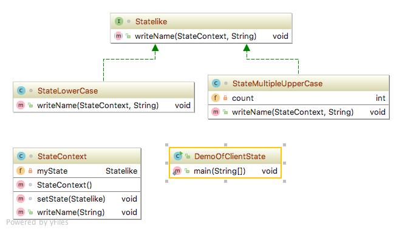

# State pattern
상태 패턴(State pattern)은 각 개별 상태를 상태 패턴 인터페이스의 파생 클래스로 구현하고, 패턴의 상속클래스로 부터 정의된 메서드를 통해 상태를 바꾸는 것으로 구현합니다.
### 상세설명
 - 현재 알고리즘을 전환하는 것으로 [[1]스트레티지 패턴](https://github.com/khkong0928/DesignPattenrs/tree/master/src/strategypattern/strategy.md)으로 해석될 수 있습니다.
 - 이 패턴은 클래스 내부 상태를 기반으로 동일한 객체에 대한 다양한 동작을 캡슐화하는데 사용됩니다.
 - 상태 패턴은 어떤 문제를 해결할 수 있는가?
   1. 내부 상태가 변경되면 객체의 동작이 변경되어야 할 수 있다.
   2. 상태별 행동은 독립적으로 정의되어야 할 수 있다.
   3. 즉 새로운 상태가 추가되어야하며 기존 상태의 행동이 독립적으로 변화되어야 할 때 사용할 수 있다.
   4. 클래스 내에서 상태 별 동작을 구현하는 것은 유연성이 떨어지기 떄문에 사용한다.
 - 상태 패턴은 어떤 솔루션으로 설명되는가?
   1. 각 상태에 대한 상태 별 동작을 캡슐화 하는 객체를 정의한다.
   2. 상태 별 동작을 수행하기 위한 인터페이스를 정의한다.
   3. 인터페이스를 구현하는 클래스를 정의한다.
 
### 클래스 설명
 - Statelike.java : State interface
 - StateLowerCase.java : State algorithm1
 - StateMultipleUpperCase.java : State algorithm2
 - StateContext.java : Objects that use state. 
 - DemoOfClientState : Client
 
### 다이어그램

### 참조:
[1]https://github.com/khkong0928/DesignPattenrs/tree/master/src/strategypattern/strategy.md

[2]https://en.wikipedia.org/wiki/State_pattern
