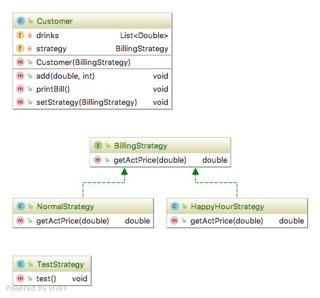

# Strategy pattern
변경이 필요한 알고리즘을 인터페이스를 통해 외부로 분리, 구체적 알고리즘 클래스를 필요에 따라 바꿔 사용할 수 있게 한다.

### 상세설명

 - 폴리시 패턴(Policy pattern) 이라고도 불림.
 - 알고리즘을 관리하는 객체를 정의한다.
 - 각각의 알고리즘은 캡슐화 되어야 한다.
 - 알고리즘을 관리 객체내부에서 교환가능하도록 만든다.
 - 알고리즘을 사용하는 클라이언트와 알고리즘을 독립적으로 변경할 수 있다.
 - 구현 필수 요구 사항은 데이터 구조의 일부 코드에 대한 참조값을 저장하고 검색하는 기능.
 - [2]개방 폐쇄 원칙 실현(Open/closed principle)에 가장 잘 맞는 패턴.
 
### 클래스 설명
 - BillingStrategy.java : Strategy interface
 - NormalStrategy.java : Algorithm object1
 - HappyHourStrategy.java : Algorithm object2
 - Customer.java : Managing each algorithm object
 - TestStrategy.java : client
 
### 다이어그램
 
 

### 참조:

[1]https://en.wikipedia.org/wiki/Strategy_pattern

[2]https://en.wikipedia.org/wiki/Open/closed_principle
